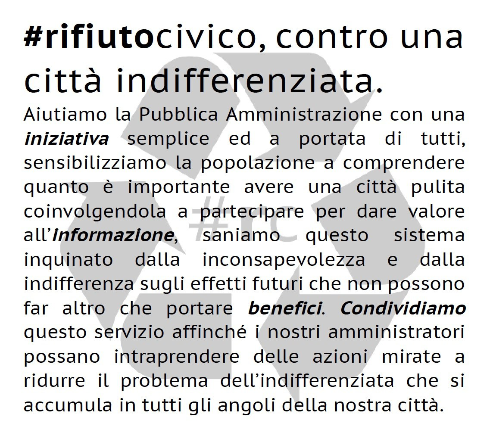

# #rifiutocivico
Un modo semplice per localizzare discariche urbane a cielo aperto al fine di coadiuvare la Pubblica Amministrazione ad affrontare il problema sul degrado urbano dovuto all’abbandono di rifiuti in luoghi pubblici.

